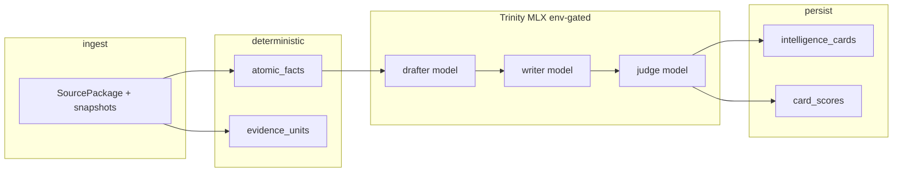

# Trinity — low-level architecture and production runbook

**Trinity** is the product name for the **MLX-based flashcard pipeline** inside the consultant / queue worker: **drafter → writer → judge** (three small models on Apple Silicon via **MLX-LM**).  

**Naming:** Use **Trinity** in user-facing and feature language. In code, the Python package is **`agent_chappie.flashcard_trinity`**; identifiers use **`trinity`** (e.g. `run_trinity`, `TrinityConfig`, `try_mlx_trinity_cards`).  

**Distinction:** Older documentation refers to a **governed triad** control plane (orchestration, artifacts, routing). That is **not** the same as Trinity. Trinity only names this **MLX flashcard** stack.

---

## 1. Current implementation map

| Path | Role |
| --- | --- |
| `src/agent_chappie/flashcard_trinity/pipeline.py` | `TrinityConfig`, `TrinityPipelineResult`, `run_drafter`, writer/judge batches, **`run_trinity`** → returns **`TrinityPipelineResult`** (`rows` + `stats`) |
| `src/agent_chappie/flashcard_trinity/schemas.py` | Pydantic: `DrafterAtom`, `WriterEnriched`, `JudgeVerdict`, `TrinityFlashcardRow` (optional `hybrid_gate_flags`, `quarantine_reason`) |
| `src/agent_chappie/flashcard_trinity/judge_rules.py` | **`apply_hybrid_judge_rules`** (IMP-03) after LLM Judge |
| `src/agent_chappie/flashcard_trinity/json_tools.py` | `first_json_decode` — extract JSON from model text |
| `src/agent_chappie/flashcard_trinity/mlx_runner.py` | `mlx_available`, `build_chat_prompt`, `with_loaded_model`, `generate_text` |
| `src/agent_chappie/flashcard_trinity/logutil.py` | Logger `agent_chappie.flashcard_trinity`, `trinity_debug_enabled()` |
| `src/agent_chappie/flashcard_trinity/worker_integration.py` | `mlx_trinity_enabled`, `TrinityWorkerResult`, `build_cards_and_scores_from_mlx_trinity`, **`try_mlx_trinity_cards`** → returns **`TrinityWorkerResult \| None`** (`None` = Trinity env off) |
| `src/agent_chappie/worker_bridge.py` | `process_job_payload` — uses **`try_mlx_trinity_cards`**; if **`used_trinity_cards`**, uses its cards/scores; else heuristic; **`record_flashcard_pipeline_run`** when `job_id` present |
| `src/agent_chappie/local_store.py` | **`record_flashcard_pipeline_run`**, **`flashcard_pipeline_runs`** table; **`card_scores.quarantine_reason`**, **`gate_flags_json`** |
| `src/agent_chappie/worker_logging.py` | `configure_worker_logging()` — sets levels; honors Trinity debug env vars |
| `scripts/worker_queue_consumer.py` | Queue loop; calls `configure_worker_logging()` then `process_job_payload` |
| `scripts/prefetch_mlx_flashcard_models.py` | Prefetch default HF repos into local cache |
| `src/agent_chappie/flashcard_triad/__init__.py` | **Deprecated** shim; re-exports old names with `DeprecationWarning` |

---

## 2. Data flow (raw → useful)



1. **Ingest:** `process_job_payload` receives `job_request` + `source_package`; snapshots and observations are updated in SQLite (`AGENT_LOCAL_DB_PATH`).
2. **Deterministic layer:** `build_atomic_facts`, `build_evidence_units`, etc.
3. **Trinity (when `FLASHCARD_MLX_TRINITY=1`):** Document excerpt → **drafter** → **writer** → **judge** → **hybrid rules** (`judge_rules`) → fused scores. Optional **`TRINITY_MAX_WALL_SECONDS`** bounds in-process wall-clock (thread pool; see §8). Final confidence = `d_conf * w_conf * j_conf`; impact product maps to `impact_score` on `[30,98]` in worker integration.
4. **Persistence:** `upsert_intelligence_cards` / `card_scores`; per job **`flashcard_pipeline_runs`** records **`trinity` \| `heuristic_fallback` \| `trinity_disabled`** plus JSON **`detail`** (outcomes, stats). Visibility: top 20% by `rank_score`; NBA ranking uses the **full** scored set (not only visible cards).

5. **Downstream — Know More + checklist:** Intelligence cards and knowledge state are included in **`build_workspace_payload`** (hosted sync: `POST /api/worker/projects/{projectId}/workspace`). **Three next actions** in `JobResult` are produced in `process_job_payload` by **`build_nba_tasks_from_intelligence_cards`** when validation succeeds: each ranked card → synthetic segment → **`segment_to_task`** → **`judge_tasks`** (same rich task shape as the segment checklist). Tasks may carry **`intel_card_id`** for UI linkage. If NBA materialization fails quality gates, the worker falls back to the **segment-derived checklist**. Product runbook table: [`docs/07_runbooks/consultant_followup_web.md`](07_runbooks/consultant_followup_web.md) § *Webapp input → automatic tasks*.

---

## 3. Model JSON contracts (model output)

**Drafter** — single JSON **array** of objects:

```json
[
  {
    "text": "string",
    "d_conf": 0.0,
    "d_impact": 0.0
  }
]
```

**Writer** — single JSON **object**:

```json
{
  "text": "string",
  "w_conf": 0.0,
  "w_impact": 0.0
}
```

**Judge** — single JSON **object**:

```json
{
  "j_conf": 0.0,
  "j_impact": 0.0,
  "implication": "string",
  "potential_moves": ["string", "string", "string"]
}
```

Validation is enforced with **Pydantic** in `schemas.py`. Non-JSON or invalid fields drop that atom/pair. **Retaining** dropped atoms with zero scores in SQLite is **not** implemented yet — backlog **§9 T-U03** (zero-score quarantine).

---

## 4. Environment variables

| Variable | Purpose | Default / notes |
| --- | --- | --- |
| **`FLASHCARD_MLX_TRINITY`** | Enable Trinity for flashcards | unset = off. Legacy: **`FLASHCARD_MLX_TRIAD`** |
| **`FLASHCARD_MLX_TRINITY_DEBUG`** | DEBUG logs + tracebacks for Trinity | Legacy: **`FLASHCARD_MLX_DEBUG`** |
| **`AGENT_WORKER_LOG_LEVEL`** | Worker root / `agent_chappie` level | `INFO` |
| **`MLX_DRAFTER_MODEL`** | HF repo id | `mlx-community/gemma-3-270m-it-4bit` |
| **`MLX_WRITER_MODEL`** | HF repo id | `mlx-community/granite-4.0-h-350m-8bit` |
| **`MLX_JUDGE_MODEL`** | HF repo id | `mlx-community/Qwen2.5-0.5B-Instruct-4bit` |
| **`FLASHCARD_MLX_CONFIDENCE_THRESHOLD`** | Min product confidence to **keep** a card in `run_trinity` | `0.5` |
| **`FLASHCARD_MLX_MAX_ATOMS`** | Max drafter items | `24` |
| **`FLASHCARD_MLX_INPUT_CHARS`** | Max chars into drafter | `12000` |
| **`FLASHCARD_MLX_JUDGE_RETRY_THRESHOLD`** | `j_conf` below this triggers extra writer+judge passes | `0.35` |
| **`FLASHCARD_MLX_WRITER_RETRY_EXTRA`** | Max extra passes per atom | `2` |
| **`FLASHCARD_MLX_SEQUENTIAL_UNLOAD`** | `1` = unload model after phase | `1` |
| **`HF_TOKEN`** | Optional Hub auth | higher rate limits |
| **`AGENT_LOCAL_DB_PATH`** | SQLite for worker brain | see worker config / `load_config()` |
| **`TRINITY_MAX_WALL_SECONDS`** | Max seconds for **`run_trinity`** in worker; with **`TRINITY_SUBPROCESS=0`** uses `ThreadPoolExecutor` (**IMP-07** orphan-thread caveat); `0` = off | `0` |
| **`TRINITY_SUBPROCESS`** | `1` = run Trinity in a **child process** when **`TRINITY_MAX_WALL_SECONDS` > 0** so timeout **kills** the process | unset |
| **`AGENT_ALLOW_HEURISTIC_FLASHCARDS`** | When Trinity is on, allow heuristic fallback if Trinity does not yield promoted cards (**T-U02** dev escape). If unset, jobs **block** with `trinity_strict_blocked`. | unset (strict) |
| **`TRINITY_PROGRESS_PERSIST`** | `1` = append **`trinity_atom_progress`** rows via pipeline hook (**TR-R05**) | unset |
| **`MLX_DRAFTER_REVISION`** / **`MLX_WRITER_REVISION`** / **`MLX_JUDGE_REVISION`** | Optional Hugging Face revision pins (**T-U05**) | unset |

---

## 5. Production: install and prefetch

**Host:** Apple Silicon Mac with Python 3.10+ (project uses 3.14 on some hosts).

```bash
cd /path/to/Agent.Chappie
python3 -m venv .venv
source .venv/bin/activate
pip install -r requirements.txt -r requirements-mlx-flashcards.txt
```

**Prefetch model weights** (recommended before first production job):

```bash
python3 scripts/prefetch_mlx_flashcard_models.py
```

**Readiness check (IMP-01)** — before enabling Trinity in launchd, optional:

```bash
python3 scripts/trinity_healthcheck.py
# or: python3 scripts/trinity_healthcheck.py --quick
```

**Expected output (abbreviated):**

```text
Downloading mlx-community/gemma-3-270m-it-4bit …
  -> /Users/…/.cache/huggingface/hub/models--mlx-community--gemma-3-270m-it-4bit/snapshots/…
…
Done.
```

**Launch worker with Trinity:**

```bash
export FLASHCARD_MLX_TRINITY=1
export AGENT_WORKER_LOG_LEVEL=INFO
# optional:
export FLASHCARD_MLX_TRINITY_DEBUG=0
python3 scripts/worker_queue_consumer.py
```

`worker_queue_consumer.py` requires **`APP_QUEUE_BASE_URL`**, **`WORKER_QUEUE_SHARED_SECRET`**, and worker DB paths per existing runbooks (`docs/07_runbooks/consultant_followup_web.md`, `vercel_mac_queue_env.md`).

**HTTP worker** (`scripts/worker_bridge.py` → `serve()`): same env vars; `configure_worker_logging()` runs inside `serve()`.

---

## 6. Queue API (hosted app ↔ Mac consumer)

The consumer uses HTTPS to the **hosted** app (not inbound to the Mac). Typical flow:

| Step | Method | Path | Headers | Body |
| --- | --- | --- | --- | --- |
| Claim job | `POST` | `{APP_QUEUE_BASE_URL}/api/worker/jobs/claim` | `Content-Type: application/json`, `x-agent-worker-secret: {WORKER_QUEUE_SHARED_SECRET}` | `{}` |
| Complete | `POST` | `…/api/worker/jobs/{job_id}/complete` | same | `{"job_result": <JobResult>}` |
| Fail | `POST` | `…/api/worker/jobs/{job_id}/fail` | same | `{"error_detail": "…"}` |

**Example claim (curl):**

```bash
curl -sS -X POST "$APP_QUEUE_BASE_URL/api/worker/jobs/claim" \
  -H "Content-Type: application/json" \
  -H "x-agent-worker-secret: $WORKER_QUEUE_SHARED_SECRET" \
  -d '{}'
```

**Expected success:** HTTP `200` with JSON containing at least `job_id`, `project_id`, `job_request`, `source_package` (exact shape defined by your hosted API).

**No job:** HTTP `204`.

**Complete:** `job_result` must satisfy `validate_job_result` in `src/agent_chappie/validation.py` (status `complete`, `result_payload`, `decision_summary`, `trace_refs`, etc.).

**Flashcard sourcing audit:** For each completed job with a non-empty `job_id`, the worker inserts one row into **`flashcard_pipeline_runs`** (see §7).

---

## 7. SQLite artifacts (Trinity-related)

When Trinity produces cards, rows are written like other intelligence cards:

- **`intelligence_cards`:** `card_id`, `insight`, `implication`, `potential_moves_json`, `fact_refs_json`, `source_refs_json`, `segment`, `channel` (`mlx_trinity` when from Trinity), `state`, `expires_at`, …
- **`card_scores`:** `confidence`, `impact_score`, `freshness_score`, `evidence_strength`, `rank_score`, plus optional **`quarantine_reason`**, **`gate_flags_json`** (IMP-02; used for Trinity score rows when populated)
- **`flashcard_pipeline_runs`:** one row per processed job (when `job_id` present): **`pipeline_source`** = `trinity` \| `heuristic_fallback` \| `trinity_disabled`; **`reason`** (short); **`detail_json`** (outcome, Trinity `stats`, errors)

**Card / fact id pattern (current):** **`card:{uuid}`** for new intelligence cards (Trinity and heuristic) and **UUID v4** for **`atomic_facts.fact_id`** (**T-U01** shipped). Legacy rows may still use older `card::…` prefixes until re-ingested.

**Synthetic ref:** if no fact/source match, `source_refs` may include `synthetic::mlx_trinity`.

Inspect locally (example):

```bash
sqlite3 "$AGENT_LOCAL_DB_PATH" "SELECT card_id, channel, substr(insight,1,80) FROM intelligence_cards WHERE channel='mlx_trinity' LIMIT 5;"
sqlite3 "$AGENT_LOCAL_DB_PATH" "SELECT job_id, pipeline_source, reason, substr(detail_json,1,120) FROM flashcard_pipeline_runs ORDER BY created_at DESC LIMIT 5;"
```

---

## 8. Committed implementation plan (in code)

**Status:** **IMP-01–IMP-04** and **IMP-07** are **delivered**: quarantine rows with reason codes in **`run_trinity`**, **`stats.drop_reason_counts`**, SQLite **`trinity_atom_progress`** (optional), **`TRINITY_SUBPROCESS`** for hard kill, and strict Trinity via **`AGENT_ALLOW_HEURISTIC_FLASHCARDS`**.

The following table is the original spec; implementation notes are inline.

| ID | Deliverable | Implemented as | Tests / commands | Expected outcome |
| --- | --- | --- | --- | --- |
| **IMP-01** | **Trinity health / readiness** | **`scripts/trinity_healthcheck.py`** — import `mlx_lm`, `load()` each default model (`--quick` = drafter only); exit `0` / `1` | `python3 scripts/trinity_healthcheck.py` | Fails fast when MLX or weights are broken |
| **IMP-02** | **Quarantine / failure reason codes** | Per-row reasons on quarantined cards; **`stats.drop_reason_counts`**; **`card_scores`** fields; **`flashcard_pipeline_runs`** includes **`trinity_strict_blocked`** | `tests.test_flashcard_pipeline_run`, `tests.test_trinity_quarantine_and_visibility` | Parse / judge / hybrid / threshold paths auditable |
| **IMP-03** | **Hybrid Judge (rules after LLM)** | **`flashcard_trinity/judge_rules.py`** — `apply_hybrid_judge_rules`; wired in **`pipeline.run_trinity`** after writer+judge retries | `python3 -m unittest tests.test_trinity_judge_rules` | Placeholder / short text / mixed-script heuristics zero `j_conf`/`j_impact` |
| **IMP-04** | **Fallback transparency** | **`record_flashcard_pipeline_run`**: `trinity` \| `heuristic_fallback` \| `trinity_disabled` \| **`trinity_strict_blocked`** + JSON detail; workspace **`latest_flashcard_pipeline_run`** | `tests.test_worker_bridge.WorkerBridgeKnowledgeTests.test_workspace_includes_latest_flashcard_pipeline_run` | Ops + UI can see last sourcing |
| **IMP-07** | **Trinity stall / timeout** | **`TRINITY_MAX_WALL_SECONDS`** + in-process thread **or** **`TRINITY_SUBPROCESS=1`** with subprocess **kill** on timeout | Manual / subprocess path | Consumer does not hang indefinitely |

**Env (IMP-07):** **`TRINITY_MAX_WALL_SECONDS`** — unset or `0` = no timeout. **`TRINITY_SUBPROCESS=1`** — use only with **`TRINITY_MAX_WALL_SECONDS` > 0** for hard kill.

**Dependencies:** Further **T-U04** polish (structured JSON logs) and **resume-from-checkpoint** (**TR-R05**) remain optional extensions.

---

## 9. Low-level actionable backlog (not all implemented)

Deliverables below extend the foundation (UUIDs, mandatory Trinity, zero-score quarantine). Each row lists **deliverable**, **tests**, and **expected outcome**.

| ID | Deliverable | Owner module / touchpoints | Tests | Expected output |
| --- | --- | --- | --- | --- |
| T-U01 | **UUID v4** for new `fact_id` / `card_id` | **Done** — `build_atomic_facts`, `build_flashcards_from_atomic_facts`, Trinity `worker_integration` | UUID shape in new rows | Old keys unchanged until re-run |
| T-U02 | **Trinity mandatory** in prod (no heuristic fallback) | **Done** — strict when Trinity on unless **`AGENT_ALLOW_HEURISTIC_FLASHCARDS=1`** | Blocked job + `trinity_strict_blocked` row | Predictable prod behavior |
| T-U03 | **Zero-score quarantine** instead of drop | **Done** — `run_trinity` **`quarantine_rows`** → DB; NBA / visibility skip rank 0 | `tests.test_trinity_quarantine_and_visibility` | Quarantined rows stored, not promoted |
| T-U04 | **Structured logs** per `job_id` | **Partial** — `trinity_timing` INFO lines + **`timings_ms`** in stats | Log capture / metrics sink TBD | Stage durations visible in logs |
| T-U05 | **HF revision pins** | **Done** — **`MLX_*_REVISION`**, prefetch script | Prefetch + load paths | Reproducible weights |
| T-U06 | **Health script** | **Done** — use **`scripts/trinity_healthcheck.py`** (**IMP-01**). This row kept as pointer only. | `python3 scripts/trinity_healthcheck.py` | Exit 0/1 |
| T-U07 | **Golden fixtures** | **Started** — `tests/fixtures/trinity/golden_drafter.json` + `tests.test_trinity_golden_fixtures` | Extend with writer/judge fixtures | Parse regression |

---

## 10. Tests (commands and expected results)

**No MLX (CI / Linux):** JSON and env tests run; MLX integration skipped.

```bash
cd /path/to/Agent.Chappie
PYTHONPATH=src python3 -m unittest tests.test_flashcard_trinity_json -v
PYTHONPATH=src python3 -m unittest tests.test_trinity_judge_rules tests.test_flashcard_pipeline_run tests.test_trinity_quarantine_and_visibility tests.test_trinity_golden_fixtures -v
```

**Expected:** all tests `ok` (includes `mlx_trinity_enabled` env variants).

```bash
PYTHONPATH=src python3 -m unittest tests.test_mlx_flashcard_trinity_integration -v
```

**Expected without `mlx_lm`:** `skipped … mlx_lm not installed`.

**Expected with MLX:** `ok` (drafter may return zero parseable atoms; test still passes if list is empty).

**Full discovery:**

```bash
PYTHONPATH=src python3 -m unittest discover -s tests -p 'test_*.py' -q
```

---

## 11. Logging reference

| Logger | When |
| --- | --- |
| `agent_chappie.flashcard_trinity` | All Trinity INFO/WARNING/DEBUG |
| Root / `agent_chappie` | `AGENT_WORKER_LOG_LEVEL` |

**Debug:** `FLASHCARD_MLX_TRINITY_DEBUG=1` or `FLASHCARD_MLX_DEBUG=1`.

---

## 12. Related documentation

- Conceptual flow (portable): [`docs/trinity_flow.md`](trinity_flow.md)
- Stack summary: [`docs/02_stack.md`](02_stack.md)
- Queue + Mac worker: [`docs/07_runbooks/consultant_followup_web.md`](07_runbooks/consultant_followup_web.md)
- Env blocks: [`docs/07_runbooks/vercel_mac_queue_env.md`](07_runbooks/vercel_mac_queue_env.md)

---

## 13. Changelog (this rename)

- Package: `flashcard_triad` → **`flashcard_trinity`** (deprecated shim remains at `agent_chappie.flashcard_triad`; shim re-exports **`try_mlx_triad_cards`** which now resolves to **`try_mlx_trinity_cards`** returning **`TrinityWorkerResult`**, not a bare tuple).
- API: `run_triad` → **`run_trinity`** (returns **`TrinityPipelineResult`**), `TriadConfig` → **`TrinityConfig`**, `try_mlx_triad_cards` → **`try_mlx_trinity_cards`** (returns **`TrinityWorkerResult \| None`**).
- Env: prefer **`FLASHCARD_MLX_TRINITY`**; **`FLASHCARD_MLX_TRIAD`** still read.
- Debug env: prefer **`FLASHCARD_MLX_TRINITY_DEBUG`**; **`FLASHCARD_MLX_DEBUG`** still read.
- **IMP-01–04, IMP-07** delivered in code (see §8); **IMP-02** partial (§8).
