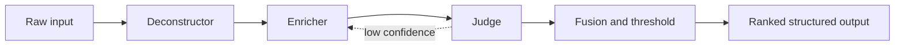

# Trinity: A Three-Stage Specialist Pipeline for Turning Raw Text into Ranked, Structured Intelligence

**Abstract.** We describe **Trinity**, a composable inference architecture in which three small language models—each in a distinct role—cooperate to transform unstructured or semi-structured input into validated, scored artifacts suitable for downstream decision support. The design couples **atomic decomposition**, **executive-grade enrichment**, and **adversarial-style judgment** with explicit numeric confidence and impact signals, combined through a transparent multiplicative scoring rule. We situate the system on **Apple Silicon** using **MLX** and **MLX-LM** for efficient on-device execution, and we outline current capabilities, planned hardening, and an idea bank for future work. This document is written to stand alone: it states the idea and its technical grounding without reference to any single product codebase.

---

## 1. Introduction

Organizations routinely possess **raw data**: emails, transcripts, web pages, CRM exports, and internal notes. The gap between that raw material and **useful information**—claims that are traceable, well-phrased, and safe to act on—is rarely closed by a single monolithic model call. Large models can summarize fluently yet blur provenance; tiny models can segment text but lack judgment; rigid rules miss nuance.

**Trinity** addresses this gap through a **deliberate division of labor**: three models, three responsibilities, one shared schema for handoff. The name reflects the **threefold structure** (not a theological claim): *deconstruction*, *enrichment*, and *judgment*. Together they implement a hypothesis we treat as the core contribution:

> **Hypothesis.** For a fixed memory and latency budget, a pipeline of **role-specialized small models** with **structured JSON handoffs** and **explicit per-stage scores** yields more controllable and auditable intelligence products than a single undifferentiated generation step, when final usefulness is defined by calibrated confidence and impact products rather than prose quality alone.

The following sections make that hypothesis operational: we define roles, data contracts, scoring, technology choices, and a roadmap.

---

## 2. Design principles

| Principle | Meaning |
| --- | --- |
| **Specialization over scale** | Each stage uses a model chosen for its *role*, not for being the largest available checkpoint. |
| **Structured handoffs** | Stages communicate through **machine-parseable** payloads (e.g. JSON objects/arrays), not free-form prose alone. |
| **Explicit uncertainty** | Every stage emits **scalar signals** (e.g. confidence and impact on \([0,1]\)) so downstream logic can aggregate without re-parsing language. |
| **Transparent fusion** | Final scores are computed by a **declared formula** (e.g. products of stage scores), not an opaque learned combiner—supporting audit and ablation. |
| **Local-first option** | The reference stack targets **on-device inference** on Apple Silicon via **MLX**, preserving data locality and predictable cost. |

---

## 3. System overview: blocks and workflow

At the highest level, Trinity is a **linear pipeline with optional local iteration**:

1. **Input assembly** — Raw text (and optionally metadata such as titles, summaries, or pre-extracted fact snippets) is bounded by length and passed to the first model.
2. **Stage A — Deconstructor (Drafter)** — Produces a list of **atomic units**: short, self-contained statements or claims, each with initial scores.
3. **Stage B — Enricher (Writer)** — Consumes each atomic unit and returns a **polished** formulation plus its own scores.
4. **Stage C — Judge** — Consumes both the original atom and the enriched text (and their scores) and returns **judgment scores** plus short structured fields (e.g. implication, suggested actions).
5. **Fusion & filtering** — Final confidence and impact are derived from stage scores; units below a **policy threshold** may be dropped or (in planned variants) retained with **zero** effective rank so no information is silently discarded from storage.
6. **Optional retry** — If judgment confidence is low, the system may **re-invoke** the enricher with a corrective hint and re-judge, bounded by a maximum number of attempts.

Conceptually:

---

## 4. Stage-by-stage behavior (conceptual)

### 4.1 Deconstructor (Drafter)

**Purpose.** Split the input into **minimal meaningful pieces** and assign **first-pass** certainty and business relevance.

**Typical output shape (conceptual).** A list of records, each containing:

- **Text** — The atomic claim or fact string.
- **d_conf** — How well the atom is grounded in the supplied input (scalar, normalized).
- **d_impact** — Estimated business or decision relevance of that atom (scalar, normalized).

**Model class (reference).** A **very small instruction-tuned** model (on the order of **hundreds of millions of parameters**), chosen for speed and low memory so long documents can be scanned with many candidate atoms without exhausting device RAM.

**Technology.** Text generation with **temperature zero** (greedy or equivalent) to stabilize JSON-like outputs; parsing and validation via a **schema layer** (e.g. Pydantic in Python ecosystems) so invalid fields are rejected at the boundary.

---

### 4.2 Enricher (Writer)

**Purpose.** Rewrite each atom into **clear, professional language** suitable for executives or operators, without inventing facts not present in the atom.

**Typical output shape.** A single record per atom:

- **text** — Enriched wording.
- **w_conf** — Fidelity / alignment to the original atom.
- **w_impact** — Strength of the business point as stated.

**Model class (reference).** A **small hybrid or long-context-friendly** model (e.g. on the order of **350M parameters** with architectures that handle longer dependencies efficiently on device).

**Technology.** Same generation and JSON extraction pattern as the deconstructor; batching multiple atoms under **one model load** is an optimization to amortize load time on memory-constrained devices.

---

### 4.3 Judge

**Purpose.** Act as a **consistency and salience** check: compare deconstructor and enricher outputs and scores, and emit a final judgment suitable for **gating** use in products.

**Typical output shape.**

- **j_conf** — Logical consistency, grounding, absence of overreach.
- **j_impact** — Strategic importance of accepting this unit.
- **implication** — One concise consequence statement.
- **potential_moves** — Short actionable items (e.g. up to three strings).

**Model class (reference).** A **small reasoning-oriented** instruct model (e.g. **0.5B-class**), chosen because compact Qwen-family checkpoints often punch above their weight on short logical tasks relative to size.

**Technology.** Identical parsing discipline; optional **bounded retry** when **j_conf** falls below a tunable threshold.

---

## 5. Scoring and trust model

Let stage scores be in \([0,1]\). A **transparent fusion** rule used in the reference design:

- **Final confidence** \(C = d_{\mathrm{conf}} \times w_{\mathrm{conf}} \times j_{\mathrm{conf}}\)
- **Final impact** \(I = d_{\mathrm{impact}} \times w_{\mathrm{impact}} \times j_{\mathrm{impact}}\)

**Interpretation.** The product form implements a **conservative AND**: a catastrophic failure at any stage drives the product toward zero. This is deliberate: downstream systems can treat **high \(C\)** as agreement across three independent “votes” on usefulness and grounding.

**Thresholding.** A policy parameter \( \tau \) (e.g. 0.5) may discard or demote units with \(C < \tau\). A **planned extension** retains rows in storage but sets **effective rank or display scores to zero** when any gate fails, preserving audit trails without promoting bad content.

**Mapping to UI scores.** When products need scales other than \([0,1]\) (e.g. 30–100 impact sliders), a **monotonic map** from \(I\) to that range is applied in a single place so the semantic core remains the product \(I\).

---

## 6. Technology stack (reference implementation)

| Layer | Technology | Role |
| --- | --- | --- |
| **On-device inference** | **MLX** (Apple) | Tensor runtime optimized for **Apple Silicon** and **unified memory**. |
| **High-level LM API** | **MLX-LM** | Model load, tokenization, chat templates, generation loop. |
| **Hardware target** | **M-series Mac** (e.g. Mac mini) | Sufficient for **multi-hundred-million** to **sub-billion** parameter models in quantized form in parallel or sequence. |
| **Model sources** | **Hugging Face Hub** | Distribution of **MLX-converted** weights (e.g. `mlx-community/*` repositories). |
| **Quantization** | **4-bit / 8-bit** variants | Keeps **three** small models within roughly **1–2 GB** of weights (order-of-magnitude), leaving headroom for context and OS. |
| **Schema validation** | **Pydantic** (or equivalent) | Enforces shapes and ranges on parsed JSON. |
| **Orchestration** | Plain code, or **LangGraph** / **PydanticAI**-class frameworks | State machine, retries, and typed agents are optional layers around the same three calls. |
| **Optional prefetch** | **huggingface_hub** `snapshot_download` | Warms local disk cache before production traffic. |

**Representative model IDs (illustrative, not prescriptive):**

| Role | Illustrative MLX community builds |
| --- | --- |
| Deconstructor | Gemma 3 **270M** instruction-tuned **4-bit** |
| Enricher | IBM Granite **4.0 H 350M** **8-bit** (hybrid SSM attention) |
| Judge | Qwen 2.5 **0.5B** Instruct **4-bit** |

Organizations may substitute **other** small MLX models if they preserve the **JSON contract** and score semantics.

---

## 7. Operational characteristics

**Memory.** Sequential **load → infer → unload** (with explicit cache clearing) reduces **peak** resident weight when three models must not all reside in GPU/unified memory at once.

**Latency.** Dominated by **model load** (if not cached) and **tokens generated** per stage; batching the enricher over many atoms amortizes load.

**Failure modes.**

- **Malformed JSON** — Parser drops the unit or (planned) assigns **zero** downstream rank with a reason code.
- **Missing MLX** — System should **fail closed** for “Trinity-only” deployments or **degrade** with an explicit policy (heuristic fallback is a *product* choice, not part of the core idea).
- **Model drift** — Mitigated by **pinning** Hub revisions or local snapshots.

**Observability.** Structured logs per **run identifier**, per-stage timings, parse success rates, and distribution of \(C\) and \(I\) support scientific comparison across prompt and model changes.

---

## 8. Scientific positioning (claims and limits)

**What Trinity claims.**

1. **Decomposability** — Intelligence work can be factored into **segmentation**, **stylistic/strategic reframing**, and **verification**, each learnable by models an order of magnitude smaller than frontier chat models.
2. **Measurability** — Scalar stage scores plus a **fixed fusion rule** make quality **testable** and **ablatable** (e.g. disable judge and observe false positive rate).
3. **Efficiency** — A **three-model** stack of **sub-billion** checkpoints can run **locally** with acceptable latency for many business documents on current Apple Silicon.

**What Trinity does not claim.**

- Optimality of the product fusion versus learned metaclassifiers (the tradeoff is **interpretability**).
- Replacement of human review for **high-stakes** decisions; Trinity is a **prioritization and drafting** layer.
- Language coverage or parity across domains without **evaluation** on those domains.

**Evaluation directions** (for a rigorous paper follow-up): human-rated usefulness, factuality against a labeled corpus, calibration of \(C\) vs. actual correctness, and A/B comparison against single-model summarization at matched token budgets.

---

## 9. Current capabilities vs. planned capabilities

**Delivered in Agent.Chappie (reference integration).** The portable design in §§3–7 is implemented in **`agent_chappie.flashcard_trinity`** with these concrete behaviors (IDs in **Appendix A**):

- End-to-end **three-model** path from bounded text excerpt to **structured cards** with **multiplicative fused scores** and **Pydantic** validation.
- **JSON** extraction from model text; rejected atoms are **quarantined** in SQLite with **`rank_score = 0`** and reason codes (**T-U03** — see [`trinity_architecture.md`](trinity_architecture.md) §9).
- **Optional bounded** writer+judge **retries** when judgment confidence is low (env-tuned thresholds).
- **Hybrid Judge** — deterministic **rules after the LLM** clamp or zero scores for obvious failures (**IMP-03**, `judge_rules.py`).
- **Per-job sourcing audit** — **`flashcard_pipeline_runs`** records **`trinity` \| `heuristic_fallback` \| `trinity_disabled` \| `trinity_strict_blocked`** (**IMP-04** / **T-U02**); workspace exposes **`latest_flashcard_pipeline_run`** to the app.
- **Quarantine metadata** — **`card_scores.quarantine_reason`**, **`gate_flags_json`**, and pipeline **`drop_reason_counts`** (**IMP-02**).
- **Wall-clock supervision** — **`TRINITY_MAX_WALL_SECONDS`**; optional **`TRINITY_SUBPROCESS=1`** for **hard kill** of the MLX child (**IMP-07**).
- **UUID** **`fact_id` / `card_id`** for new rows (**T-U01**); **HF revision** env vars + prefetch (**T-U05**).
- **Strict Trinity** when enabled — heuristic fallback only if **`AGENT_ALLOW_HEURISTIC_FLASHCARDS=1`** (**T-U02**).
- **Readiness script** — **`scripts/trinity_healthcheck.py`** (**IMP-01**).
- **Environment-driven** model IDs, thresholds, max atoms, input caps; Trinity **debug** logging hooks.

**Still planned (engineering and research).**

- **Richer telemetry** — JSON **metrics** export or OpenTelemetry (**T-U04** remainder).
- **Golden datasets** — expand beyond drafter fixture; score-distribution regression (**T-U07**).
- **Drafter-level** invalid JSON / empty list as explicit quarantine row (today: stats only when no atoms).
- **TR-R05–TR-R09** deeper items — resume checkpoints, section-level repair, full model/revision UI, multi-candidate Judge (see [`03_roadmap.md`](03_roadmap.md)).

---

## 10. Idea bank (future extensions)

*Ordered roughly from near-term to speculative.*

1. **Fourth specialist** — A lightweight **fact-linking** or **entity-resolution** model that attaches canonical IDs to atoms before enrichment.
2. **Cross-atom judge** — A pass that reads **all** accepted atoms to remove redundancy and enforce global consistency (mini “editor” model).
3. **Calibration layer** — Temperature scaling or isotonic regression on \(C\) using labeled data so thresholds map to empirical precision.
4. **Alternative fusion** — Harmonic mean or learned **logit** combiner, with **shadow mode** logging to compare against the product rule without changing production.
5. **Speculative decoding** — Draft model for the enricher to cut latency where MLX-LM supports it.
6. **Multimodal deconstructor** — Same three-role pattern with a **vision** front-end (charts, slides) feeding text atoms.
7. **Federated or split deployment** — Deconstructor on edge, judge on secure enclave, etc., with encrypted handoffs.
8. **Human-in-the-loop hooks** — UI that surfaces **low \(C\)** items for rapid correction, feeding **active learning** for stage-specific adapters.

---

## 11. Conclusion

**Trinity** is a **documented, reproducible pattern**: three small models, strict schemas, explicit scores, multiplicative fusion, and MLX-based local execution. It embodies a testable idea—that **structure and specialization** beat **opaque scale** for turning **raw text** into **ranked, actionable information** under memory and privacy constraints. The architecture is **portable**: the same stages can be reimplemented on other runtimes (e.g. other local engines or hosted APIs) as long as the **contracts** and **scoring semantics** are preserved.

**Authorship note.** This architecture is presented as a **collaborative design**: the **roles, scoring story, and MLX-centric deployment story** are the intellectual contribution; concrete checkpoints and hyperparameters are **engineering choices** that may evolve with new releases on Hugging Face and MLX.

---

## 12. References (informal)

- Apple **MLX** and **MLX-LM** documentation and repositories.
- **Hugging Face** model hubs for **mlx-community** conversions (Gemma, Granite, Qwen families cited illustratively).
- Literature on **multi-agent** and **pipeline** LLM systems, **mixture of experts**, and **calibration** of uncertainty (for rigorous citations, a future version of this memo should add numbered bibliographic entries).

---

## Appendix A — Agent.Chappie: committed implementation plan

*This appendix ties the portable Trinity design to the **Agent.Chappie** worker implementation. Full IDs, file targets, and test expectations live in **[`docs/trinity_architecture.md`](trinity_architecture.md) §8**.*

**Delivered (baseline):** **IMP-01–IMP-04**, **IMP-07** — including **quarantine rows** + **`drop_reason_counts`**, **`trinity_strict_blocked`**, **`TRINITY_SUBPROCESS`**, UUID ids, revision pins, and workspace **pipeline** summary (see [`trinity_architecture.md`](trinity_architecture.md) §8).

**Product handoff:** Intelligence cards feed **{knowmore}** in the workspace payload and, when quality gates pass, **three next actions** materialized via **`build_nba_tasks_from_intelligence_cards`** (card → synthetic segment → same task engine as the checklist). Operator runbook: [`docs/07_runbooks/consultant_followup_web.md`](07_runbooks/consultant_followup_web.md) § *Webapp input → automatic tasks*.

| ID | Theme | Summary |
| --- | --- | --- |
| **IMP-01** | Health / readiness | Script (and optional launchd preflight) to verify MLX and default Trinity model repos before the queue consumer runs. |
| **IMP-02** | Auditability | Quarantine **rows** + per-job **`flashcard_pipeline_runs`** + score **reason** fields; stats enumerate drop reasons. |
| **IMP-03** | Hybrid Judge | **Rule layer after the LLM** (length, placeholders, language heuristics) to clamp scores or mark quarantine. |
| **IMP-04** | Transparency | **`trinity` \| `heuristic_fallback` \| `trinity_disabled` \| `trinity_strict_blocked`**; app sees **`latest_flashcard_pipeline_run`**. |
| **IMP-07** | Supervision | **`TRINITY_MAX_WALL_SECONDS`** (thread or **subprocess** hard kill). |

**Roadmap extensions** (baseline pieces exist; deepen per **[`docs/03_roadmap.md`](03_roadmap.md)** *Trinity extended roadmap*): resumable checkpoints, richer Writer repair, full model surfacing, multi-candidate Judge.

---

*Document type: conceptual specification and scientific narrative. Sections 1–12 are portable; **Appendix A** is Agent.Chappie–specific.*
